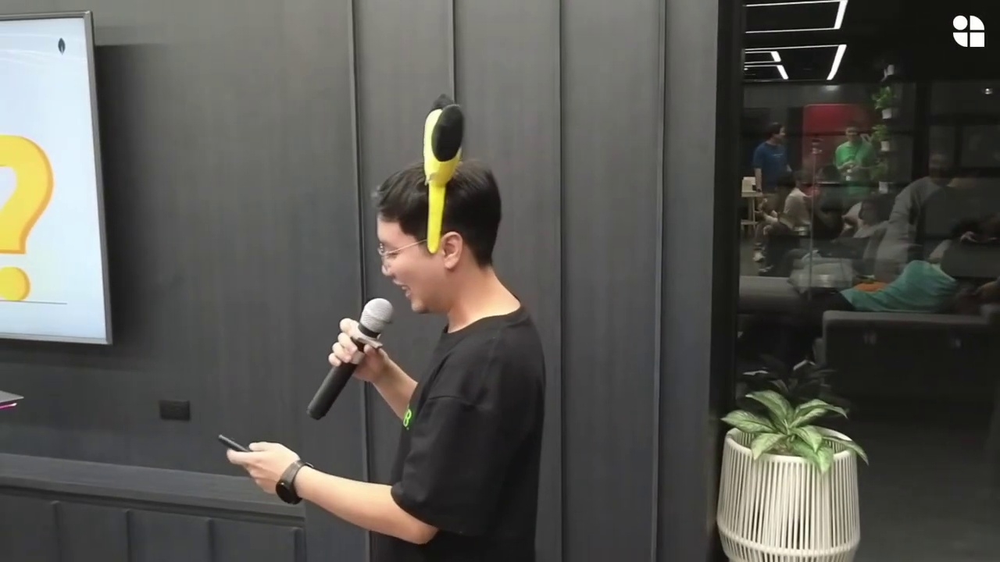
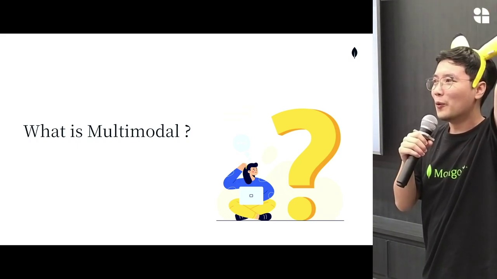
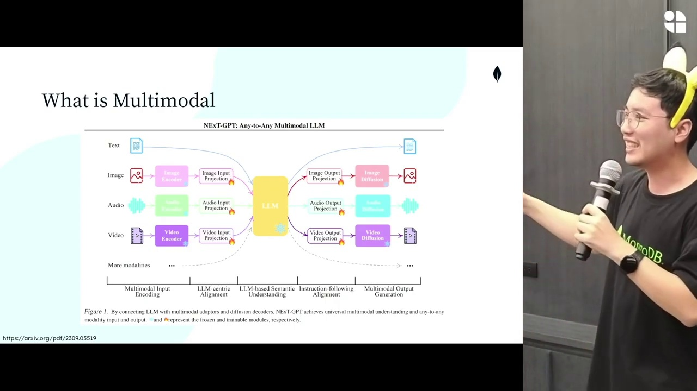
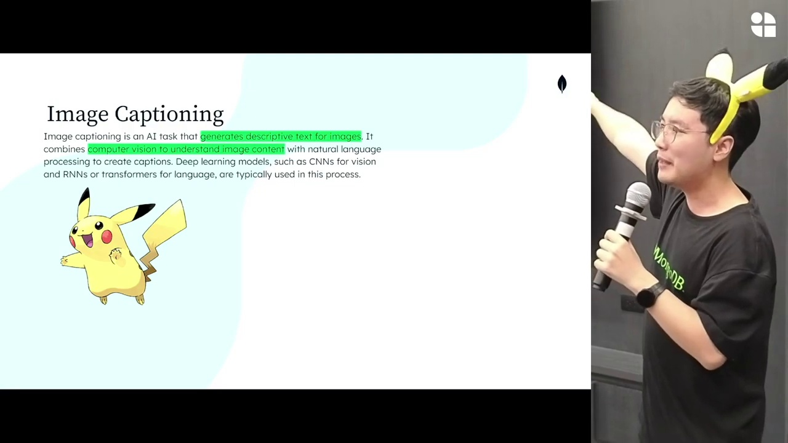
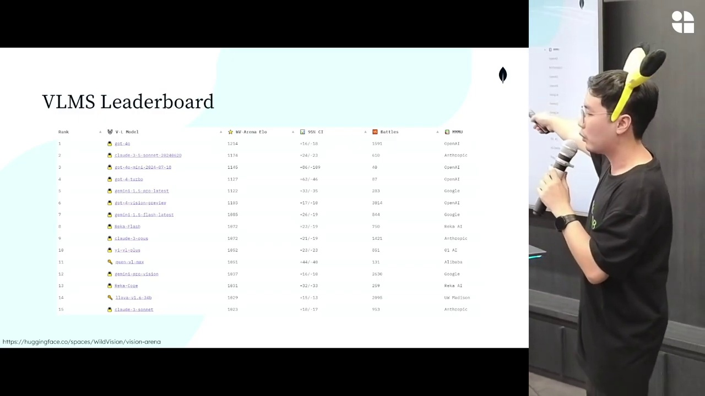
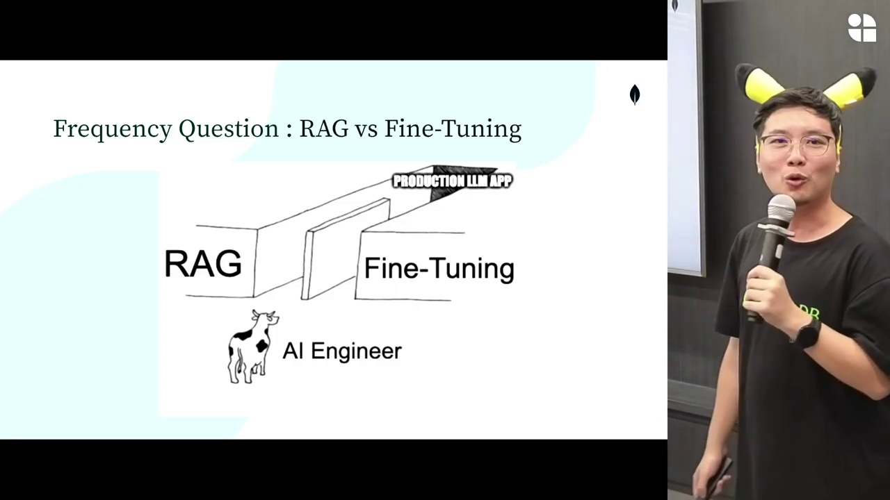
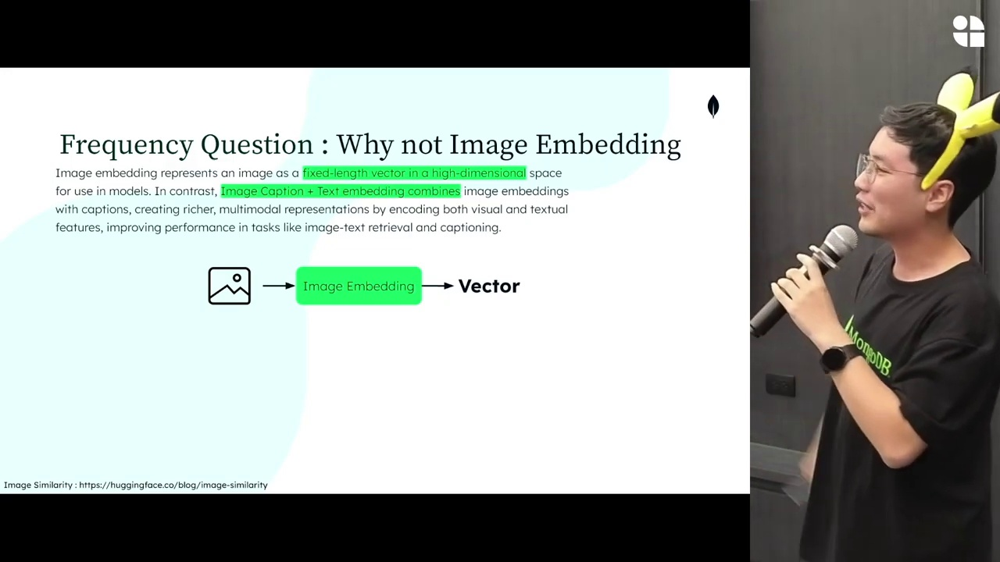
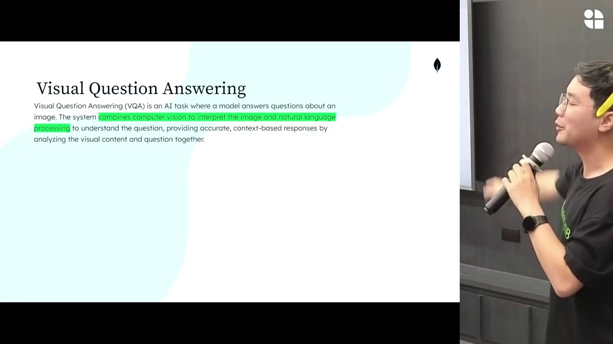
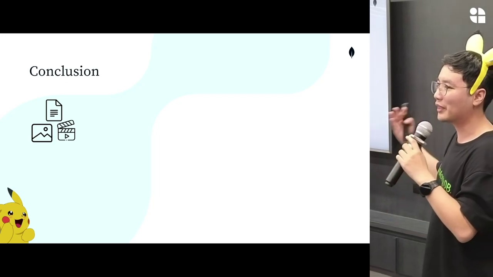

## Executive Summary
เซกชันนี้เป็นการอธิบายพื้นฐานของ **Multimodal Models**, แนวคิดการแปลงข้อมูลหลายประเภท (ภาพ เสียง วิดีโอ ข้อความ) ให้กลายเป็นข้อความ และนำไปใช้ในงาน **RAG / LLM / Vector Search** รวมถึงปูพื้นฐานสู่ Workshop การทำ Image Captioning → Embedding → Vector Database → Search

เนื้อหามีทั้งทฤษฎีและตัวอย่างจริง โดยผู้พูด (S2) พาไล่ตั้งแต่คำว่า *LM / LOM / Multimodal / Image Captioning / VQA / Vector DB / Embeddings* ไปจนถึงการประยุกต์ใช้ MongoDB Atlas Search

---

## Speaker Highlights
- **S1**: เปิดบทสนทนาด้วยความขำเล็กน้อย
- **S2 (วิทยากรหลัก)**: อธิบายแนวคิดทั้งหมดเกี่ยวกับ Multimodal, AI, Embedding, Vector DB และขั้นตอนการทำ Workshop
- **S3–S17 และกลุ่มผู้ฟัง**: ถาม-ตอบ, มุกตลก, มีปฏิสัมพันธ์หลายช่วง

---

## Timeline Summary (พร้อมภาพตัวแทน)

### **0–30s — บทนำและแนะนำตัว**
S2 แนะนำตัว อธิบายหัวข้อที่ทุกคนน่าจะสนใจ เช่น LOM, LM, Multimodal

---

### **60–120s — เริ่มอธิบาย “LM vs LOM” และ Generative AI เบื้องต้น**
ผู้พูดโยงจากคำว่า Generative AI → Text Input → Text Output → แนวคิด Unimodal → ปูทางสู่ Multimodal

---

### **250–330s — อุดมคติของ Multimodal Model (แปลงทุกอย่างเป็น Text ก่อน)**
เปิดสไลด์สำคัญ: ภาพ, วิดีโอ, เสียง → Text → LLM → Decoder

---

### **430–520s — Image Captioning และหลักการ Matching Image ↔ Text**
อธิบาย Vision-Language Model, การแปลงภาพเป็น text caption และ embeddings

---

### **630–690s — อธิบาย CLIP / Vision-Language Matching และปัญหา Hallucination**
พูดถึงการฝึกโมเดลภาพ+ข้อความ, การแปลงเป็นเวกเตอร์ร่วม

---

### **740–820s — RAG vs Fine-tune vs LLaMA Adapter**
ช่วงถามตอบสนุก ๆ เรื่องทำ RAG และ Fine-tune อะไรแพงกว่า

---

### **1030–1100s — เหตุผลที่ “ภาพต้องผ่าน Caption ก่อน Embedding”**
อธิบายชัดเจนว่าทำไม image → vector โดยตรงไม่เหมาะกับ RAG

---

### **1300–1370s — VQA (Visual Question Answering)**
เริ่มเข้าสู่โจทย์ VQA และวิธี naive vs วิธีที่ควรทำด้วย VQA Model

---

### **1450–1500s — สรุปคอนเซ็ปต์ Multimodal + RAG**
ทบทวนแนวคิดตั้งแต่ multimodal encoding → vector database → querying

---

### **1570–1600s — เปิดเข้าสู่ Workshop Image Captioning → Embedding → Vector Search**
เริ่มเดินเข้าส่วนปฏิบัติจริงบน Colab และ MongoDB Atlas

---
